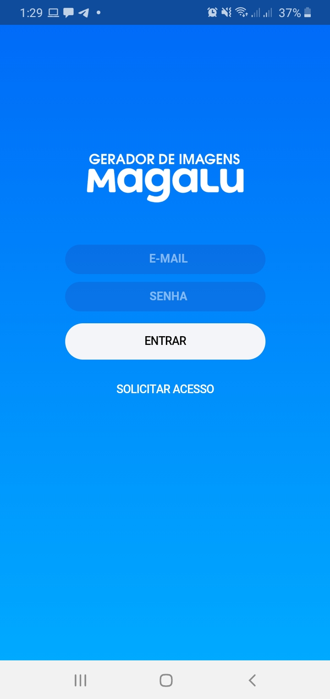
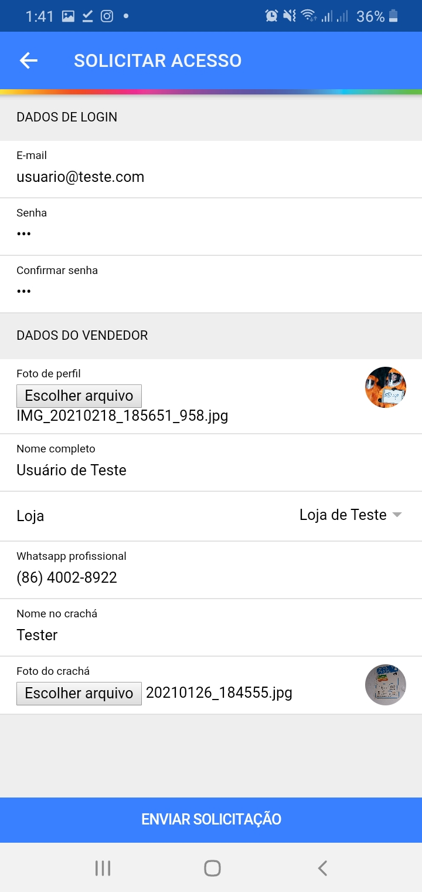

Este foi um aplicativo que fiz em meados de 2020, durante a pandemia de **COVID-19** para **ajudar meu pai**, vendedor do **Magazine Luiza**, que estava trabalhando em **home office** e precisava mostrar para seus clientes algumas ofertas que a empresa não fornecia banners.

## Screenshots

| Página de login | Página de cadastro | Mensagem de sucesso no cadastro |
|-|-|-|
|  |  |  |

| Página inicial | Cadastrando novo produto | Pré-visualização da imagem |
|-|-|-|
|  |  |  |

## Informações legais

Devo adverter: **esta não é uma ferramenta oficial do Magazine Luiza**. Portanto, o uso não autorizado pode estar sujeito à ações tanto pelo desenvolvedor, quanto pelo Magazine Luiza. Abaixo, há alguns tópicos que podem ser lidos e não devem ser ignorados.

### Evite frustrações lendo estes itens

- Qualquer uso e acesso não autorizado deste aplicativo está sugeito à tomada de ações imediatas
- O código-fonte deste projeto foi mantido público por algum tempo, entretando, por questões de uso de imagem, o código-fonte desta aplicação voltou a ser privado. Isto impede que pessoas má intencionadas façam mal uso da imagem do Magazine Luiza
- O uso deste aplicativo não é garantido via qualquer tipo de pagamento. Poupe seu tempo ao tentar enviar uma proposta de uso paga
- O objetivo desta página é apenas prover uma forma fácil de meu pai ter acesso às últimas releases do aplicativo, e também servir como item de portfólio pessoal

## Documentação da API

Em breve...

---

Todos os direitos reservados © 2020

Feito com :heart: por [@jjpaulo2](https://github.com/jjpaulo2)